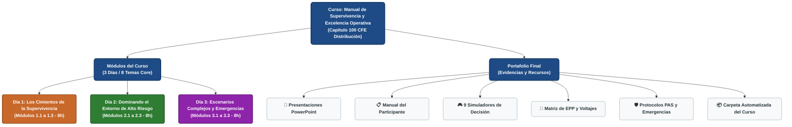

# Estructura del Curso

```mermaid
graph TD
    classDef main fill:#1e4b85,stroke:#102c52,stroke-width:2px,color:#fff,font-weight:bold,rx:8px,ry:8px;
    classDef day1 fill:#c8682a,stroke:#8c4414,stroke-width:2px,color:#fff,font-weight:bold,rx:6px,ry:6px;
    classDef day2 fill:#2e7d32,stroke:#1b4d20,stroke-width:2px,color:#fff,font-weight:bold,rx:6px,ry:6px;
    classDef day3 fill:#8e24aa,stroke:#5c1470,stroke-width:2px,color:#fff,font-weight:bold,rx:6px,ry:6px;
    classDef portfolio fill:#f8f9fa,stroke:#b0bec5,stroke-width:1.5px,color:#263238,font-weight:bold,rx:6px,ry:6px;

    Title["Curso: Manual de Supervivencia y Excelencia Operativa<br>(Capítulo 100 CFE Distribución)"]:::main
    
    Modules["Módulos del Curso<br>(3 Días / 8 Temas Core)"]:::main
    Portafolio["Portafolio Final<br>(Evidencias y Recursos)"]:::main

    Title --> Modules
    Title --> Portafolio

    D1["Día 1: Los Cimientos de la Supervivencia<br>(Módulos 1.1 a 1.3 - 8h)"]:::day1
    D2["Día 2: Dominando el Entorno de Alto Riesgo<br>(Módulos 2.1 a 2.3 - 8h)"]:::day2
    D3["Día 3: Escenarios Complejos y Emergencias<br>(Módulos 3.1 a 3.3 - 8h)"]:::day3

    Modules --> D1
    Modules --> D2
    Modules --> D3

    P1["📁 Presentaciones PowerPoint"]:::portfolio
    P2["📋 Manual del Participante"]:::portfolio
    P3["🎮 9 Simuladores de Decisión"]:::portfolio
    P4["📑 Matriz de EPP y Voltajes"]:::portfolio
    P5["🛡️ Protocolos PAS y Emergencias"]:::portfolio
    P6["📦 Carpeta Automatizada del Curso"]:::portfolio

    Portafolio --> P1
    Portafolio --> P2
    Portafolio --> P3
    Portafolio --> P4
    Portafolio --> P5
    Portafolio --> P6

    click D1 "file:///C:/Users/VICTOR/VICTOR%20INSTRUCTOR/DESARROLLO%20DE%20CURSOS%20CON%20IA/PRESENTACIONES%20POWER%20POINT/ACTIVIDADES%20QUE%20SALVAN%20VIDAS%20AQSV.pptx" "Abrir Presentación Día 1"
    click D2 "file:///C:/Users/VICTOR/VICTOR%20INSTRUCTOR/DESARROLLO%20DE%20CURSOS%20CON%20IA/PRESENTACIONES%20POWER%20POINT/Capítulo_100_Seguridad_e_Higiene.pptx" "Abrir Capítulo 100"
    click D3 "file:///C:/Users/VICTOR/VICTOR%20INSTRUCTOR/DESARROLLO%20DE%20CURSOS%20CON%20IA/PRESENTACIONES%20POWER%20POINT/Trabajos%20en%20Líneas%20Desenergizadas%20-%20CFE%20y%20SUTERM.pptx" "Abrir Líneas Desenergizadas"
    click P1 "file:///C:/Users/VICTOR/VICTOR%20INSTRUCTOR/DESARROLLO%20DE%20CURSOS%20CON%20IA/PRESENTACIONES%20POWER%20POINT/" "Ver Carpeta Presentaciones"
    click P6 "file:///C:/Users/VICTOR/VICTOR%20INSTRUCTOR/DESARROLLO%20DE%20CURSOS%20CON%20IA/" "Ver Carpeta Raíz"
```
